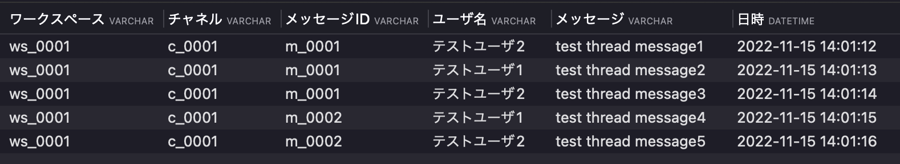
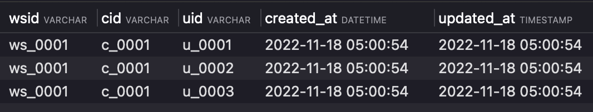
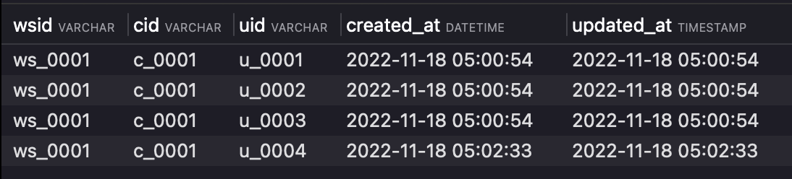
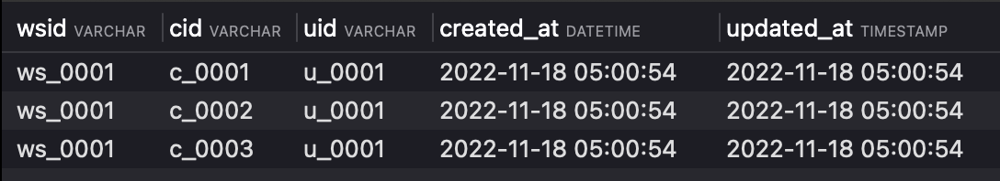
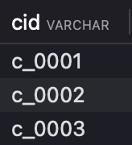
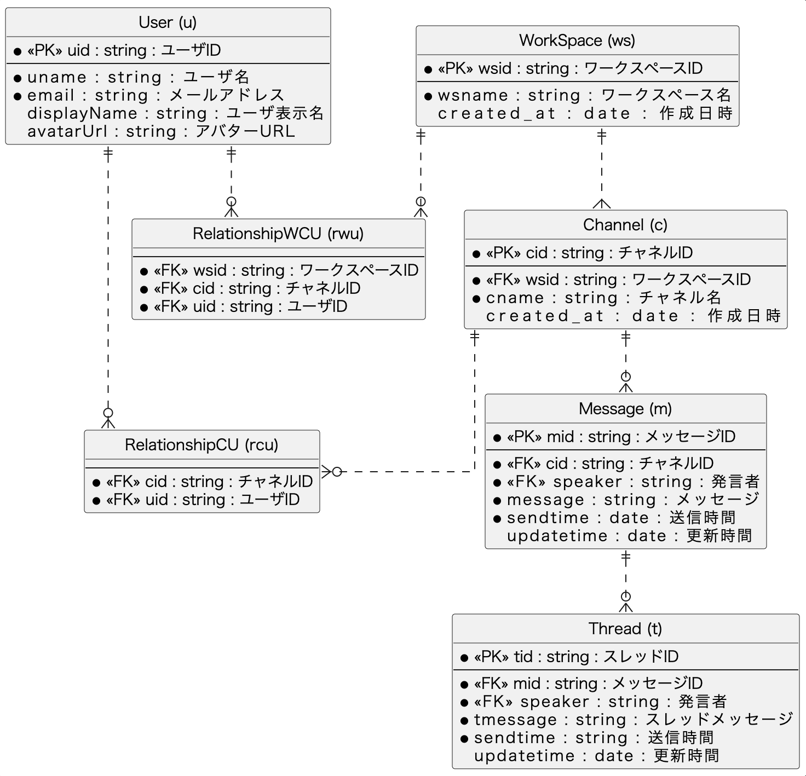
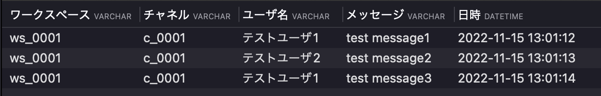
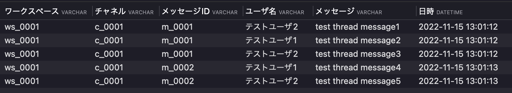
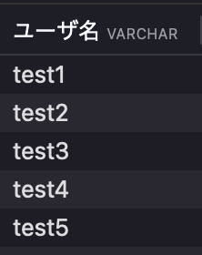
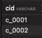

# 課題2
## slackのようなチャットアプリのDB設計

### DBスキーマ設計

以下、各テーブルの管理する項目を記載する
1. User(u)
  + ユーザIDをプライマリキーとして、ユーザを管理するテーブル。
  + ユーザ名、ユーザ表示名、メールアドレス、アバターを表示する為のURLをカラムとして持つ
2. WorkSpace(ws)
  + ワークスペースIDをプライマリキーとして、ワークスペースの一覧を管理するテーブル。
  + ワークスペース名をカラムとして持つ
3. Channel(c)
  + チャネルIDをプライマリキーとして、チャネルの一覧と、チャネルが所属するワークスペースを管理するテーブル。
  + チャネルID、ワークスペースID、チャネル名をカラムとして持つ
4. Message(m)
  + メッセージIDをプライマリキーとして、全メッセージの一覧を管理するテーブル。
  + メッセージID、チャネルID、発言者、メッセージ、送信時間をカラムとして持つ
5. Thread(t)
  + スレッドIDをプライマリキーとして、メッセージIDに紐づけてスレッドの一覧を管理するテーブル。
  + スレッドID、メッセージID、発言者、スレッドメッセージ、送信時間をカラムとして持つ
6. RelationshipWCU(rwcu)
  + ワークスペースIDを外部キーとして、ワークスペースに所属するチャネル、ユーザの関係を管理するテーブル
  + ワークスペースID、チャネルID、ユーザIDをカラムとして持つ


### テーブル作成
DBの構築手順は以下へ記載。

#### 前提
Dockerが使用できる環境

1. 以下のコマンドを実行
```bash
docker run --name mysql01 -e MYSQL_ROOT_PASSWORD=root -p 3306:3306 -d mysql:latest
```
2. プロセスが起動しているか確認
```bash
docker ps
```
以下のような出力があればOK
```bash
CONTAINER ID   IMAGE          COMMAND                  CREATED      STATUS         PORTS                               NAMES
0ed8373f8e3c   mysql:latest   "docker-entrypoint.s…"   2 days ago   Up 3 seconds   0.0.0.0:3306->3306/tcp, 33060/tcp   mysql01
```

3. docker execでコンテナと接続

```bash
docker exec -it mysql01 /usr/bin/mysql -u root -p
```

passwordは先ほど実行した`root`と記載し、Enter。

4. DBを作成する。(今回は`chatapp`というDBを作成)
```sql
-- CREATE DATABASE
CREATE DATABASE IF NOT EXISTS chatapp;
```

5. 以下のSQLを使用し、各テーブルを作成  
./sql/create_table.sql

6. 以下のSQLを使用し、サンプルデータをインサート  
./sql/insert_sample_data.sql

#### ユースケース
1. 特定のチャネル[c_0001]でのメッセージの取得
   
```sql
select 
	ws.wsid as ワークスペース,
	m.cid as チャネル,
	u.displayName as ユーザ名,
	m.message as メッセージ,
	 m.sendtime as 日時
from m
inner join u on m.speaker = u.uid
inner join c on m.cid = c.cid
inner join ws on c.wsid = ws.wsid
where c.cid = 'c_0001'
```


2. スレッドメッセージの取得
  + 特定のチャネルでスレッドとして送信された各メッセージ毎のスレッドメッセージの取得
```sql
select 
	ws.wsid as ワークスペース,
	c.cid as チャネル,
	m.mid as メッセージID,
	u.displayName as ユーザ名,
	t.tmessage as メッセージ,
	 m.sendtime as 日時
from m 
inner join t on	m.mid = t.mid
inner join c on m.cid = c.cid
inner join u on t.speaker = u.uid
inner join ws on c.wsid = ws.wsid
where m.cid = 'c_0001'
```


3. チャネルに所属するユーザのみメッセージを閲覧可能
検索処理は後々かなり重たい処理になることが予想されるので、最初に特定のワークスペース内のチャネルに選択したユーザが存在するかどうかチェックするクエリを実行する。
検索の実行は上記1. 2. のクエリを使用すれば実行可能。
選択したユーザの存在確認を実行するクエリを実行した後、1.2.で使用したクエリを実行し、チャネル内のメッセージ・スレッドを取得する
```sql
-- 各検索を実施するワークスペース・チャネル・ユーザを入力
set @WORKSPACE_ID = 'ws_0001';
set @CHANNEL_ID = 'c_0001';
set @USER_ID = 'u_0004';
set @IS_USER = (select count(*) from rwcu where wsid = @WORKSPACE_ID and cid = @CHANNEL_ID and uid = @USER_ID);
-- 結果が1であれば検索実行。0であればチャネル内に存在しないユーザなので検索を実行しない。
select @IS_USER;
```


4. ユーザのワークスペース参加脱退及び、チャネルに参加及び脱退
各ユーザがどのワークスペースもしくはチャネルに所属しているかは[rwcu]テーブルで管理する。
上記テーブルへレコードを挿入すると参加、レコードを削除すると脱退できる。
例えば、現在ワークスペース1に所属しているユーザは以下。
```sql
-- 所属ユーザ確認用クエリ
select * from rwcu where wsid = 'ws_0001' and cid = 'c_0001'
```


ワークスペース1のチャネル1にはuidが `u_0001`,`u_0002`,`u_0003` のユーザが所属していることがわかる。
このワークスペース1のチャネル1へユーザを登録するのは以下のクエリ。

```sql
-- ユーザをワークスペース1のチャネル1へ追加
INSERT INTO rwcu (wsid, cid, uid) VALUES ('ws_0001','c_0001','u_0004')
```



また、ワークスペース1[`ws_0001`]からユーザ1[`u_0001`]を脱退させる場合のクエリは以下
```sql
-- rwcuテーブルのワークスペース1にユーザ1が存在するかどうか確認
select * from rwcu where wsid = 'ws_0001' and uid = 'u_0001'
```
ワークスペース1のチャネル1~3に参加していることを確認


```sql
-- rwcuテーブルのワークスペース1からユーザ1を脱退させる
delete from rwcu where wsid = 'ws_0001' and uid = 'u_0001'
```

5. 横断的な検索機能
処理の流れとしては以下。
- 問題3で使用した`rwcu`テーブルを使用して、検索を使用するユーザがどのチャネルに存在しているか確認
- 検索結果から所属しているチャネルに限定し、横断的な検索を実行
```sql
-- 特定のワークスペースとユーザIDからユーザがどのチャネルに所属しているか確認
set @WORKSPACE_ID = 'ws_0001';
set @USER_ID = 'u_0001';
select cid from rwcu where wsid = @WORKSPACE_ID and uid = @USER_ID
```


上記検索にヒットしたチャネルで全文検索

```sql
-- 上記クエリの検索結果を使ってスレッドとメッセージを`test`という文言で検索
select 
	m.speaker as メッセージ送信者,
	m.message as メッセージ,
	t.speaker as スレッドメッセージ送信者,
	t.tmessage as スレッドメッセージ,
from m 
left join t on m.mid = t.mid
where 
	m.message like '%test%' 
	and (m.cid = 'c_0001' or m.cid = 'c_0002' or m.cid = 'c_0003')
```

## レビュー指摘事項
- review1
	> RelationshipWCUテーブルが第2正規形を満たしていないように見えます。
	理由としては、チャネルIDがワークスペースIDに対して部分関数従属になっているためです。
	具体的な問題としては、以下の場合にユーザーとワークスペースを紐づける方法がありません。
	例
	①ユーザーを作ってそのユーザーがワークスペースを作ったが、まだチャンネルを作っていない場合
	②既存ワークスペースにユーザーを追加させたが、またどのチャンネルにも追加していない場合

- review後の対応
	> ①ユーザーを作ってそのユーザーがワークスペースを作ったが、まだチャンネルを作っていない場合  
	②既存ワークスペースにユーザーを追加させたが、またどのチャンネルにも追加していない場合

	レビューより、上記2点の考慮漏れが判明した。
	確かに指摘の通りで、ワークスペース・チャネル・ユーザで紐づける`rwcu`テーブルでは、第二正規系を満たしておらず、部分関数従属になっており、チャネルがない場合のワークスペースとユーザを紐付けられていない。ワークスペースとチャネル、ワークスペースとユーザの二つのテーブルを作成することで対応しようと思う。
	新たにER図を再作成してみた。

	### レビュー後ER図
	

	上記に伴って各テーブルを作成するSQLを修正
	> ./sql/create_table_v1.sql

	テーブル構成変更に伴って、ユースケースが実行できるか確認してみる。
	
	#### 特定のチャネル[c_0001]でのメッセージの取得
	こちらは問題なくそのままのクエリで実行可能。
		
	```sql
	select 
		ws.wsid as ワークスペース,
		m.cid as チャネル,
		u.displayName as ユーザ名,
		m.message as メッセージ,
		m.sendtime as 日時
	from m
	inner join u on m.speaker = u.uid
	inner join c on m.cid = c.cid
	inner join ws on c.wsid = ws.wsid
	where c.cid = 'c_0001'
	```
	

	#### スレッドメッセージの取得
  こちらも問題なさそう。

	```sql
	select 
		ws.wsid as ワークスペース,
		c.cid as チャネル,
		m.mid as メッセージID,
		u.displayName as ユーザ名,
		t.tmessage as メッセージ,
		 m.sendtime as 日時
	from m 
	inner join t on	m.mid = t.mid
	inner join c on m.cid = c.cid
	inner join u on t.speaker = u.uid
	inner join ws on c.wsid = ws.wsid
	where m.cid = 'c_0001'
	```
	

	#### チャネルに所属するユーザのみメッセージを閲覧可能
	こちらはすこし以下の部分が修正が必要だった。
	rwcuテーブルをrwuとrcuに分割したので、以下のクエリへ変更した。
	```sql
	select count(*) from rwu inner join c on rwu.wsid = c.wsid where rwu.wsid = @WORKSPACE_ID and c.cid = @CHANNEL_ID and rwu.uid = @USER_ID
	```
	実行結果は以下となった。
	```sql
	-- 各検索を実施するワークスペース・チャネル・ユーザを入力
	set @WORKSPACE_ID = 'ws_0001';
	set @CHANNEL_ID = 'c_0001';
	set @USER_ID = 'u_0004';
	set @IS_USER = (select count(*) from rwu inner join c on rwu.wsid = c.wsid where rwu.wsid = @WORKSPACE_ID and c.cid = @CHANNEL_ID and rwu.uid = @USER_ID)
	-- 結果が1であれば検索実行。0であればチャネル内に存在しないユーザなので検索を実行しない。
	select @IS_USER;
	```
	

	#### ユーザのワークスペース参加脱退及び、チャネルに参加及び脱退

	各ユーザがどのワークスペースもしくはチャネルに所属しているかは[rwcu]テーブルで管理していたが、[rwu]と[rcu]へ分割した為、クエリの修正が必要。
	  
	現在ワークスペース1に所属しているユーザは以下。
	```sql
	-- 所属ユーザ確認用クエリ
	select 
	 DISTINCT u.uname as ユーザ名
	from rwu 
	inner join c on rwu.wsid = c.wsid
	inner join u on rwu.uid = u.uid
	where rwu.wsid = 'ws_0001'
	```
	

	このワークスペース1のチャネル1へユーザ`test6`を登録するのは以下のクエリ。

	```sql
	-- 新規ユーザをuテーブルへ追加する。→ slackへ登録するイメージ
	INSERT INTO u (uid, uname, email, displayName) VALUES ('u_0006', 'test6', 'test6@gmail.com', 'テストユーザ6')

	-- 新規ユーザをワークスペース1へ追加する。rwuテーブルでワークスペースとユーザを紐づける
	INSERT INTO rwu (wsid, uid) VALUES ('ws_0001','u_0006')

	-- 新規ユーザをワークスペース1のチャネル1へ追加
	INSERT INTO rcu (cid, uid) VALUES ('c_0001','u_0006')

	```

	また、ワークスペース1`ws_0001`からユーザ1`test6`を脱退させる場合のクエリは以下
	```sql
	-- チャンネル1からユーザtest6を脱退させる
	DELETE FROM rcu where cid = 'c_0001' and uid = 'u_0006'

	-- ワークスペース1からユーザtest6を脱退させる
	DELETE FROM rwu where wsid = 'ws_0001' and uid = 'u_0006'
	```

	#### 横断的な検索機能
	
	処理の流れとしてはレビュー前と同様以下となる。
	`rwu`と`rcu`テーブルを使用して、検索を使用するユーザがどのチャネルに存在しているか確認。検索結果から所属しているチャネルに限定し、横断的な検索を実行

	```sql
	-- 特定のワークスペースとユーザIDからユーザがどのチャネルに所属しているか確認
	set @WORKSPACE_ID = 'ws_0001';
	set @USER_ID = 'u_0001';
	select 
		rcu.cid 
	from rwu 
	inner join rcu on rwu.uid = rcu.uid
	where rwu.wsid = @WORKSPACE_ID and rcu.uid = @USER_ID
	```
	ワークスペース1`ws_001`で`u_0001`が所属しているチャンネルは以下。
	

	上記検索にヒットしたチャネル`c_0001`と`c_0002`で全文検索

	```sql
	-- 上記クエリの検索結果を使ってスレッドとメッセージを`test`という文言で検索
	select 
		m.speaker as メッセージ送信者,
		m.message as メッセージ,
		t.speaker as スレッドメッセージ送信者,
		t.tmessage as スレッドメッセージ 
	from m
	left join t on m.mid = t.mid
	where m.message like '%test%' and (m.cid = 'c_0001' or m.cid = 'c_0002')
	```


- review2
	> こちらは異論があるかと思いますが、
	メッセージがスレッドをぶら下げるのには個人的に違和感があります。
	Slackを物理的にみると、ワークスペースが複数チャンネルを持ち、チャンネルが複数スレッドを持ち、スレッ	ドが複数メッセージを持つと考えた方が自然ではないでしょうか。
	DBレベルでは、
	・スレッドテーブルはid, created_atくらいだけ持つ
	・メッセージテーブルのみがmessageカラムを持つ
	実装レベルでは、
	・チャンネルに新規にメッセージを投稿した時に、スレッドIDを発行し、メッセージに持たせるようにする
	・検索機能はメッセージテーブルのみがmessageカラムのみをSELECTする

	こちらはチーム内で議論
	問題文的にはメッセージにスレッドメッセージが紐づくような記載があるが、各スレッドが複数メッセージを持つ考え方も理解できる。
	より最適な方を採択する予定。

- review3
	> 余談ですが、sendtimeとcreated_atはどのような背景でしょうか？

	create_atとupdate_atは全テーブルにつける必要はなさそう。
	必要なテーブルのみでカラムとしてつけるように修正
