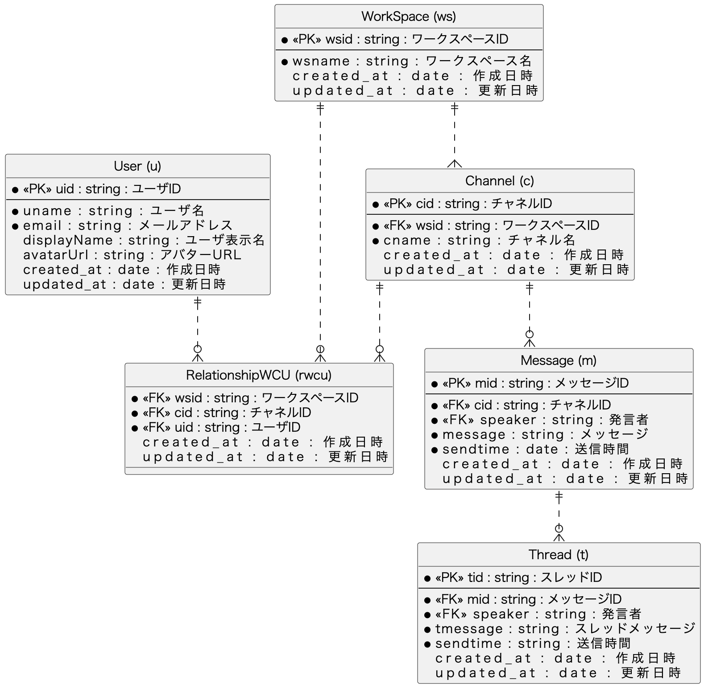

# 課題2
## slackのようなチャットアプリのDB設計

### DBスキーマ設計


### テーブル作成
#### ユースケース
DBの構築手順は以下へ記載。

#### 前提
Dockerが使用できる環境

1. 以下のコマンドを実行
```bash
docker run --name mysql01 -e MYSQL_ROOT_PASSWORD=root -p 3306:3306 -d mysql:latest
```
2. プロセスが起動しているか確認
```bash
docker ps
```
以下のような出力があればOK
```bash
CONTAINER ID   IMAGE          COMMAND                  CREATED      STATUS         PORTS                               NAMES
0ed8373f8e3c   mysql:latest   "docker-entrypoint.s…"   2 days ago   Up 3 seconds   0.0.0.0:3306->3306/tcp, 33060/tcp   mysql01
```

3. docker execでコンテナと接続

```bash
docker exec -it mysql01 /usr/bin/mysql -u root -p
```

passwordは先ほど実行した`root`と記載し、Enter。

4. DBを作成する。(今回は`chatapp`というDBを作成)
```sql
-- CREATE DATABASE
CREATE DATABASE IF NOT EXISTS chatapp;
```

5. 以下のSQLを使用し、各テーブルを作成  
./sql/create_table.sql

6. 以下のSQLを使用し、サンプルデータをインサート  
./sql/insert_sample_data.sql

7. 後は以下のSQLを使用すれば、月別の合計金額が取得できる  
./sql/monthly_aggregation.sql

実行結果は以下

```sql
-- 各月の集計を出すクエリ
select
    sum(OD.amount*PE.price) as 支払い金額,
    DATE_FORMAT(OH.order_date, '%Y-%m') as 各月の集計金額
from 
	OrderDetails as OD
inner join 
	OrderHistory as OH
on
	OD.od_id = OH.od_id
inner join 
	Product as PT
on
	OD.p_id = PT.p_id	
inner join 
	Price as PE
on
	PT.price_id = PE.price_id
group by
  	OH.order_date
```
