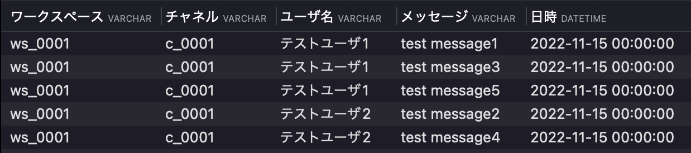

# 課題2
## slackのようなチャットアプリのDB設計

### DBスキーマ設計


### テーブル作成
DBの構築手順は以下へ記載。

#### 前提
Dockerが使用できる環境

1. 以下のコマンドを実行
```bash
docker run --name mysql01 -e MYSQL_ROOT_PASSWORD=root -p 3306:3306 -d mysql:latest
```
2. プロセスが起動しているか確認
```bash
docker ps
```
以下のような出力があればOK
```bash
CONTAINER ID   IMAGE          COMMAND                  CREATED      STATUS         PORTS                               NAMES
0ed8373f8e3c   mysql:latest   "docker-entrypoint.s…"   2 days ago   Up 3 seconds   0.0.0.0:3306->3306/tcp, 33060/tcp   mysql01
```

3. docker execでコンテナと接続

```bash
docker exec -it mysql01 /usr/bin/mysql -u root -p
```

passwordは先ほど実行した`root`と記載し、Enter。

4. DBを作成する。(今回は`chatapp`というDBを作成)
```sql
-- CREATE DATABASE
CREATE DATABASE IF NOT EXISTS chatapp;
```

5. 以下のSQLを使用し、各テーブルを作成  
./sql/create_table.sql

6. 以下のSQLを使用し、サンプルデータをインサート  
./sql/insert_sample_data.sql

#### ユースケース
1. 特定のチャネル[c_0001]でのメッセージの取得
   
```sql
select 
	ws.wsid as ワークスペース,
	m.cid as チャネル,
	u.displayName as ユーザ名,
	m.message as メッセージ,
	 m.sendtime as 日時
from 
	m
inner join
	u
on 
	m.speaker = u.uid
inner join
	c
on
	m.cid = c.cid
inner join
	ws
on
	c.wsid = ws.wsid
where
	c.cid = 'c_0001'
```


2. スレッドメッセージの取得
   特定のチャネル[c_0001]でメッセージの取得
```sql

```


1. チャネルに所属しているユーザのみメッセージ表示
```sql

```


4. 検索機能
  要件は以下
  + メッセージとスレッドメッセージを横断的に検索できること
  + 参加していないチャネルのメッセージ・スレッドメッセージは検索できないこと
```sql

```

