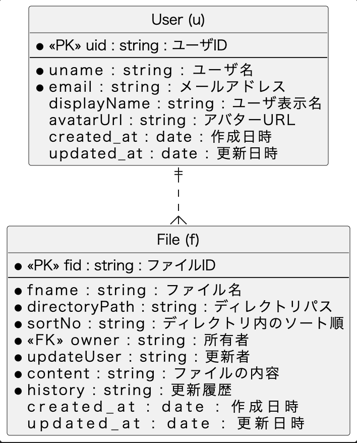
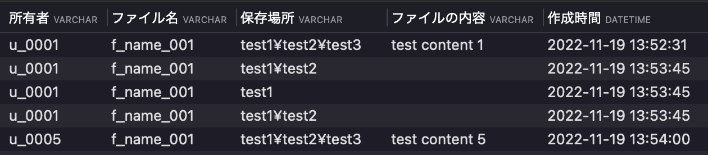
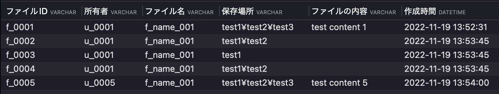
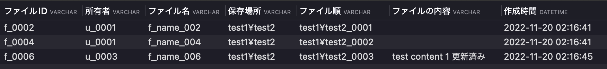
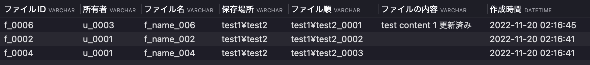
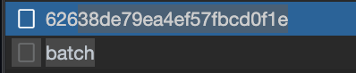

# 課題3
## Confluenceやesaやkibelaのようなドキュメント管理システムのデータベースを設計

### DBスキーマ設計

以下、各テーブルの管理する項目を記載する
1. User(u)
  + ユーザIDをプライマリキーとして、ユーザを管理するテーブル。
  + ユーザ名、ユーザ表示名、メールアドレス、アバターを表示する為のURLをカラムとして持つ
2. File(f)
  + ファイルIDをプライマリキーとして、ファイルの一覧を管理するテーブル。
  + ファイル名、ディレクトリパス、所有者、更新者、更新履歴をカラムとして持つ


### テーブル作成
DBの構築手順は以下へ記載。

#### 前提
Dockerが使用できる環境

1. 以下のコマンドを実行
```bash
docker run --name mysql01 -e MYSQL_ROOT_PASSWORD=root -p 3306:3306 -d mysql:latest
```
2. プロセスが起動しているか確認
```bash
docker ps
```
以下のような出力があればOK
```bash
CONTAINER ID   IMAGE          COMMAND                  CREATED      STATUS         PORTS                               NAMES
0ed8373f8e3c   mysql:latest   "docker-entrypoint.s…"   2 days ago   Up 3 seconds   0.0.0.0:3306->3306/tcp, 33060/tcp   mysql01
```

3. docker execでコンテナと接続

```bash
docker exec -it mysql01 /usr/bin/mysql -u root -p
```

passwordは先ほど実行した`root`と記載し、Enter。

4. DBを作成する。(今回は`document`というDBを作成)
```sql
-- CREATE DATABASE
CREATE DATABASE IF NOT EXISTS document;
```

5. 以下のSQLを使用し、各テーブルを作成  
./sql/create_table.sql

6. 以下のSQLを使用し、サンプルデータをインサート  
./sql/insert_sample_data.sql

#### ユースケース
- ドキュメント
  + fテーブルでファイル名、ファイルの所有者、ファイルの内容を管理する
	+ 所属するディレクトリはディレクトリパスで文字列として管理
- ディレクトリ
  + ディレクトリはパス形式の文字列で管理
  + 具体的には、directoryPathがtest1¥test2という文字列があれば、test1ディレクトリ内のtest2という箇所に該当ファイルが保存されている。
  + 文字列で記載しているだけなので、ディレクトリは無限にサブディレクトリを持つことができる。また、階層の変更も可能
```sql
select 
	 owner as 所有者,
	 fname as ファイル名,
	 directoryPath as 保存場所,
	 content as ファイルの内容,
	 created_at as 作成時間
from f
```



#### 課題1
- ユーザ
  + ドキュメントをCRUD（作成、参照、更新、削除）できる
	+ ディレクトリをCRUDできる
```sql
-- 現在保存されているファイルの確認
select 
	fid as ファイルID,
	 owner as 所有者,
	 fname as ファイル名,
	 directoryPath as 保存場所,
	 content as ファイルの内容,
	 created_at as 作成時間
from f
```


```sql
-- ファイル登録
INSERT INTO f (fid, fname, directoryPath,sortNo, owner, updateUser, content, history) VALUES 
('f_0006','f_name_006','test1¥test2¥test3¥test4','test1¥test2¥test3¥test4_0001','u_0003','',"test content 1",'')

-- 特定のディレクトリに存在するファイルの参照
select 
	fid as ファイルID,
	 owner as 所有者,
	 fname as ファイル名,
	 directoryPath as 保存場所,
	 content as ファイルの内容,
	 created_at as 作成時間
from f
where directoryPath = 'test1¥test2'

-- ファイル削除
DELETE FROM f where fid = 'f_0006'

-- ファイルの更新
update f set directoryPath='test1¥test2', updateUser="u_0003", content="test content 1 更新済み", history="更新済みの文言を追記しました。" where fid='f_0006';
```

#### 課題2
- ディレクトリ内のファイル順は`sortNo`によって管理する。
`test1¥test2`というディレクトリの中に保存されているファイルの順番を考える
```sql
-- 特定のディレクトリに存在するファイルの並び順について
select 
	fid as ファイルID,
	 owner as 所有者,
	 fname as ファイル名,
	 directoryPath as 保存場所,
	 sortNo as ファイル順,
	 content as ファイルの内容,
	 created_at as 作成時間
from f
where directoryPath = 'test1¥test2'
order by sortNo asc

```


並び替える場合はファイル順`sortNo`の数字を入れ替えて対応する。

具体的には、`fid`が`f_0006`のファイルを`f_0002`へ移動させるクエリは以下。

```sql
update f set sortNo='test1¥test2_0001' where directoryPath='test1¥test2' and fid='f_0006';
update f set sortNo='test1¥test2_0002' where directoryPath='test1¥test2' and fid='f_0002';
update f set sortNo='test1¥test2_0003' where directoryPath='test1¥test2' and fid='f_0004';
```


#### food for thought
- trelloの要素を並び替えた時のリクエスト


カードIDをリクエストURLに持たせて、リクエストを実行
> https://trello.com/1/cards/62638de79ea4ef57fbcd0f1e


returnされるレスポンスは以下
```json
{
  "id": "62638de79ea4ef57fbcd0f1e",
  "badges": {
    "attachmentsByType": { "trello": { "board": 0, "card": 0 } },
    "location": false,
    "votes": 0,
    "viewingMemberVoted": false,
    "subscribed": true,
    "fogbugz": "",
    "checkItems": 0,
    "checkItemsChecked": 0,
    "checkItemsEarliestDue": null,
    "comments": 0,
    "attachments": 0,
    "description": false,
    "due": null,
    "dueComplete": false,
    "start": null
  },
  "checkItemStates": [],
  "closed": false,
  "dueComplete": false,
  "dateLastActivity": "2022-11-20T04:33:21.274Z",
  "desc": "",
  "descData": { "emoji": {} },
  "due": null,
  "dueReminder": null,
  "email": "ysk_stk+2rsjfrel9koxukx4d6w+2ya07pie2pzqakgjqxq+0kxbas8kek@boards.trello.com",
  "idBoard": "623566b4083fd65fe6760799",
  "idChecklists": [],
  "idList": "6235679d905a3b6f9ba41f2b",
  "idMembers": ["5c6296d40b3ebb887e27ccc8"],
  "idMembersVoted": [],
  "idShort": 13,
  "idAttachmentCover": null,
  "labels": [],
  "idLabels": [],
  "manualCoverAttachment": false,
  "name": "【資格】Azure AZ-400",
  "pos": 470527,
  "shortLink": "Vifx2XZ2",
  "shortUrl": "https://trello.com/c/Vifx2XZ2",
  "start": null,
  "subscribed": true,
  "url": "https://trello.com/c/Vifx2XZ2/13-%E3%80%90%E8%B3%87%E6%A0%BC%E3%80%91azure-az-400",
  "cover": {
    "idAttachment": null,
    "color": null,
    "idUploadedBackground": null,
    "size": "normal",
    "brightness": "dark",
    "idPlugin": null
  },
  "isTemplate": false,
  "cardRole": null
}

```

処理の流れとしては、以下と考える。
1. urlにカードIDを持たせ、リクエスト
2. 画面側のUIを変更
3. バックエンドでbatch処理を走らせてDB内に保存されているカードの順番を変更

具体的にカードの順番をどのように管理しているかは現在調査中。

+ Trelloのカードを入れ替えた時のリクエストは以下。
```
Request URL: https://trello.com/1/batch?urls=%2FMember%2F5c6296d40b3ebb887e27ccc8%2Fdeltas%3FixLastUpdate%3D450%26tags%3Dmessages%252Cupdates%2C%2FOrganization%2F62247efbee29d55ea087d6db%2Fdeltas%3FixLastUpdate%3D8%26tags%3DallActions%252Cupdates%2C%2FBoard%2F622c149981d55f1294106cf0%2Fdeltas%3FixLastUpdate%3D624%26tags%3DclientActions%252Cupdates%2C%2FBoard%2F62247f1dc49a0645f2c71926%2Fdeltas%3FixLastUpdate%3D4931%26tags%3DclientActions%252Cupdates%2C%2FBoard%2F62444bd03e3128210ecbd81b%2Fdeltas%3FixLastUpdate%3D2403%26tags%3DclientActions%252Cupdates%2C%2FBoard%2F623566b4083fd65fe6760799%2Fdeltas%3FixLastUpdate%3D341%26tags%3DclientActions%252Cupdates
Request Method: GET
Status Code: 200 
Remote Address: 104.192.137.9:443
Referrer Policy: origin-when-cross-origin
access-control-allow-headers: Authorization, Accept, Content-Type
access-control-allow-methods: GET, PUT, POST, DELETE
access-control-allow-origin: *
access-control-expose-headers: x-rate-limit-api-key-interval-ms, x-rate-limit-api-key-max, x-rate-limit-api-key-remaining, x-rate-limit-api-token-interval-ms, x-rate-limit-api-token-max, x-rate-limit-api-token-remaining
atl-traceid: 9f2ad564289d999b
cache-control: max-age=0, must-revalidate, no-cache, no-store
content-length: 439
content-type: application/json; charset=utf-8
date: Sun, 20 Nov 2022 04:28:54 GMT
expect-ct: report-uri="https://web-security-reports.services.atlassian.com/expect-ct-report/trello-edge", max-age=86400
expires: Thu, 01 Jan 1970 00:00:00
nel: {"failure_fraction": 0.001, "include_subdomains": true, "max_age": 600, "report_to": "endpoint-1"}
pragma: no-cache
referrer-policy: strict-origin-when-cross-origin
report-to: {"endpoints": [{"url": "https://dz8aopenkvv6s.cloudfront.net"}], "group": "endpoint-1", "include_subdomains": true, "max_age": 600}
server: AtlassianEdge
strict-transport-security: max-age=63072000; preload
surrogate-control: no-store
x-content-type-options: nosniff
x-dns-prefetch-control: off
x-download-options: noopen
x-frame-options: DENY
x-permitted-cross-domain-policies: none
x-server-time: 1668918534474
x-trello-environment: Production (Micros)
x-trello-version: 1.170481.0
x-xss-protection: 1; mode=block
:authority: trello.com
:method: GET
:path: /1/batch?urls=%2FMember%2F5c6296d40b3ebb887e27ccc8%2Fdeltas%3FixLastUpdate%3D450%26tags%3Dmessages%252Cupdates%2C%2FOrganization%2F62247efbee29d55ea087d6db%2Fdeltas%3FixLastUpdate%3D8%26tags%3DallActions%252Cupdates%2C%2FBoard%2F622c149981d55f1294106cf0%2Fdeltas%3FixLastUpdate%3D624%26tags%3DclientActions%252Cupdates%2C%2FBoard%2F62247f1dc49a0645f2c71926%2Fdeltas%3FixLastUpdate%3D4931%26tags%3DclientActions%252Cupdates%2C%2FBoard%2F62444bd03e3128210ecbd81b%2Fdeltas%3FixLastUpdate%3D2403%26tags%3DclientActions%252Cupdates%2C%2FBoard%2F623566b4083fd65fe6760799%2Fdeltas%3FixLastUpdate%3D341%26tags%3DclientActions%252Cupdates
:scheme: https
accept: */*
accept-encoding: gzip, deflate, br
accept-language: ja,en-US;q=0.9,en;q=0.8
cookie: ajs_anonymous_id=%22c19edce5-f8ed-cc54-b21a-2c86d125f369%22; atl_xid.ts=1667964690752; atl_xid.current=%5B%7B%22type%22%3A%22xc%22%2C%22value%22%3A%221522f59d-bc41-4303-819a-14c44e23867f%22%2C%22createdAt%22%3A%222022-11-09T03%3A31%3A30.737Z%22%7D%5D; _gcl_au=1.1.1469293169.1667964691; _mkto_trk=id:594-ATC-127&token:_mch-trello.com-1667964691599-64784; lang=ja; token=5c6296d40b3ebb887e27ccc8%2FATTSrcjwhzsUAOXYg5SF7LHIvrsteBIkvJsNl2SeIk7flqxr7bDxcEJnXgN5usGG0d0R72527955; idMember=5c6296d40b3ebb887e27ccc8; hasAccount=atlassian; loggedIn=1; mab=5c6296d40b3ebb887e27ccc8; __cid=5eGl7UqDx2q_rXhDJIW9FJdSDszWcpBD_IgcXuuKfT_h2DDbX4uTXZSlCWv3tgMZI4hYXILX3vmojWXN_YBIUv_3cyuy5203k-R2ccqmJ37XxXY9luZjMYzgLH625mM7k6haP5yoWA3f0Ddvz9cma6C_Pn6--Gcymt9yPLThY3HKuyBwzL43drTAQxOzpDcyluNyfrjtdDWQoTcdl_p4M5qnJm7Ipidwz6YnfqzpcT-N4ThrzL85bcnkHzvOv3Zsxr1xKfyPnF5rgHZuzu1xbJruixO-xlASuqg_F5H8cjLfwXk90aQ3F5H8cjLX2j5-tvp-LdfcWnff2HsrjKhQLJ74fzec-zcRj-15GbOoUjCY4Xk706hYLprmUBLfvDlv1iwHb8a_J3HOpyZ-xrInbsW4J_H3iKJ_Oj5dlf9bFoN83vBeFIvgEjsCgtsAil-e_4gXXv-IF17_iBde_4gXXv-IF17_iBde_4gXXv-IF17_yFcev8hXXv-IF17_iBde_4gXHv-IF17_iBde_4gXoQ; atlUserHash=1767800840; G_ENABLED_IDPS=google; atlCohort={"bucketAll":{"bucketedAtUTC":"2022-11-20T04:27:58.751Z","version":"2","index":68,"bucketId":0}}; bxp_gateway_request_id=fa20ca14-c9d6-80a3-daed-00db33c04d04; atl_session=05ab8976-aff1-43ba-9d9b-d44bd40cdefc; _sp_ses.dc4d=*; dsc=c2cd7142c2ee48cebb2668f7706672a64d4f8f3d19865975637ae0d0ef5d97c4; preAuthProps=s%3A5c6296d40b3ebb887e27ccc8%3AisEnterpriseAdmin%3Dfalse.%2FX2JNhTh%2F6jO7rAF3O%2FTyDXRZ9kxVexjfIjExMokgwc; _sp_id.dc4d=91015cc3-5379-4391-83c6-eff428ef2e3a.1667964691.2.1668918512.1667965227.03510492-94f5-42d1-a3a7-43273fab7096
referer: https://trello.com/b/cutaDQ0A/uber-%E8%B1%8A%E5%B4%8E%E6%94%AF%E5%BA%97
sec-ch-ua: "Google Chrome";v="107", "Chromium";v="107", "Not=A?Brand";v="24"
sec-ch-ua-mobile: ?0
sec-ch-ua-platform: "macOS"
sec-fetch-dest: empty
sec-fetch-mode: cors
sec-fetch-site: same-origin
user-agent: Mozilla/5.0 (Macintosh; Intel Mac OS X 10_15_7) AppleWebKit/537.36 (KHTML, like Gecko) Chrome/107.0.0.0 Safari/537.36
x-trello-client-version
x-trello-operation-name: pollingFallback
x-trello-operation-source: batch
x-trello-polling: true
```

