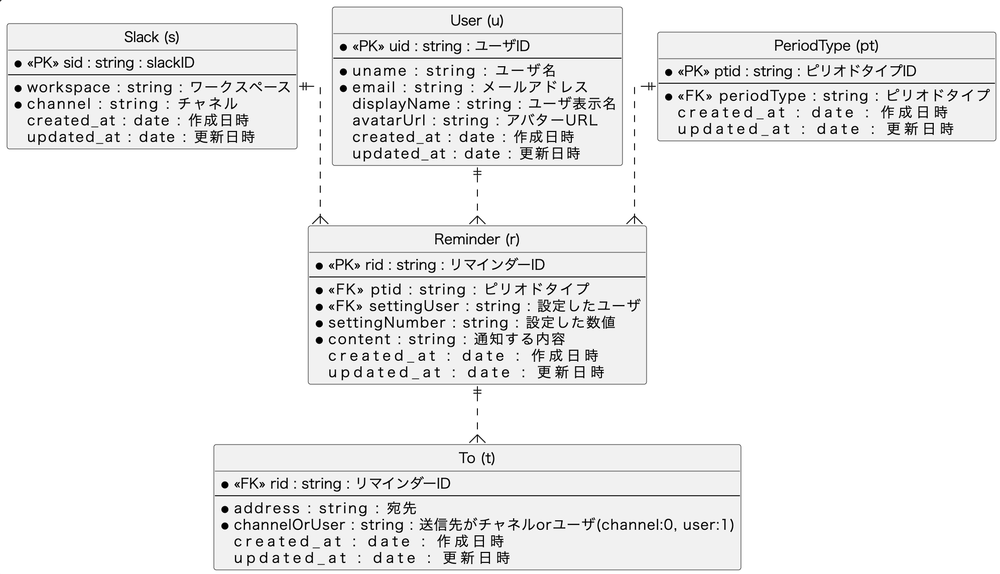
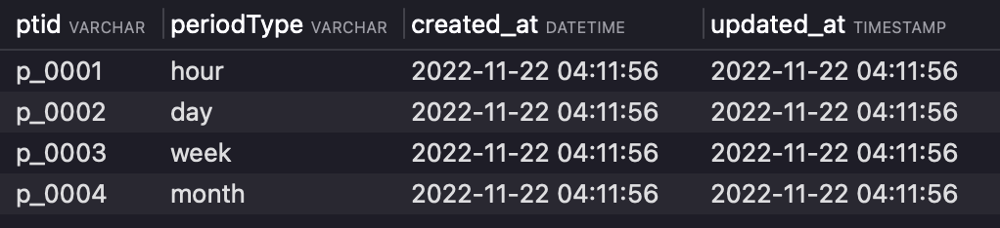

# 課題4
## Penpenのデータベースを設計

### DBスキーマ設計
  
以下、各テーブルの管理する項目を記載する
1. Slack(s)
  + スラックIDをプライマリキーとして、slackの情報を管理するテーブル。
  + ワークスペースと各ワークスペースに所属するチャネルの情報をカラムとして持つ。
2. User(u)
  + ユーザIDをプライマリキーとして、ユーザを管理するテーブル。
  + ユーザ名、ユーザ表示名、メールアドレス、アバターを表示する為のURLをカラムとして持つ
3. PeriodType(pt)
  + ピリオドタイプIDをプライマリキーとして、リマインドする間隔を管理するテーブル。
  + ピリオドタイプ(毎年、毎月、毎日etc...)をカラムとして持つ
4. Reminder(r)
  + リマインダーIDをプライマリキーとして、設定者やリマインド先、リマインド内容を設定するテーブル。
  + 設定したユーザ、スラックID、設定した間隔、ピリオドタイプ、通知する内容をカラムとして持つ
5. To(t)
  + リマインダーIDを外部キーとして、宛先を設定するテーブル。
  + 宛先をカラムとして持つ

### テーブル作成
DBの構築手順は以下へ記載。

#### 前提
Dockerが使用できる環境

1. 以下のコマンドを実行
```bash
docker run --name mysql01 -e MYSQL_ROOT_PASSWORD=root -p 3306:3306 -d mysql:latest
```
2. プロセスが起動しているか確認
```bash
docker ps
```
以下のような出力があればOK
```bash
CONTAINER ID   IMAGE          COMMAND                  CREATED      STATUS         PORTS                               NAMES
0ed8373f8e3c   mysql:latest   "docker-entrypoint.s…"   2 days ago   Up 3 seconds   0.0.0.0:3306->3306/tcp, 33060/tcp   mysql01
```

3. docker execでコンテナと接続

```bash
docker exec -it mysql01 /usr/bin/mysql -u root -p
```

passwordは先ほど実行した`root`と記載し、Enter。

4. DBを作成する。(今回は`penpen`というDBを作成)
```sql
-- CREATE DATABASE
CREATE DATABASE IF NOT EXISTS penpen;
```

5. 以下のSQLを使用し、各テーブルを作成  
./sql/create_table.sql

6. 以下のSQLを使用し、サンプルデータをインサート  
./sql/insert_sample_data.sql

#### ユースケース
- リマインダーの設定
ユーザから設定される際に指定される項目は以下。
```
/penpen @user 例のお仕事、お願いしますね！ every 3 days
```  
slack上の上記コマンドより、以下の情報を取得する。
- ユーザ名
- リマインドする内容
- リマインドする間隔

チャネルに関しては上記コマンドを実行するチャンネルへリマインダーを設定する。
具体例として`test1`ユーザが以下のコマンドがslackより送信されたとする。
```
/penpen @test2 task4 終わりましたか？ every 1 day
```
また、リマインダーの送信相手指定はtテーブルで管理する。
１つのリマインダーIDにつき、tテーブルで宛先を管理する。

上記より、以下のクエリでリマインダーを設定する。
```sql
set @USER="test1";
set @TO="test2";
set @CONTENT="task4 終わりましたか？";
set @PERIODTYPE="day";
set @settingNumber=1;

set @FROMUID=(select uid from u where uname=@USER);
set @TOUID=(select uid from u where uname=@TO);
set @PTID=(select ptid from pt where periodType=@PERIODTYPE);

INSERT INTO r (rid, settingUser,settingNumber ,ptid, content) VALUES 
('r_0004',@FROMUID, 1,@PTID, @CONTENT);
INSERT INTO t (rid, address,channelOrUser) VALUES 
('r_0004',@TO,0);
```


  
- 1時間毎にbatが実行され、リマインダーを配信するケース

```sql
/* 1時間間隔で取得するリマインド内容と宛先を取得 */
select 
	  r.rid,
	  r.settingNumber,
	  r.content,
	  pt.periodType,
	  t.address
from r
inner join u on r.settingUser = u.uid
inner join pt on r.ptid = pt.ptid
inner join t on r.rid = t.rid
where r.settingNumber = 1

```


- リマインダーの周期
今後増えるかもしれないとのことなので、ptテーブルに切り出し管理した。
下記で`year`などが追加されても対応可能。
